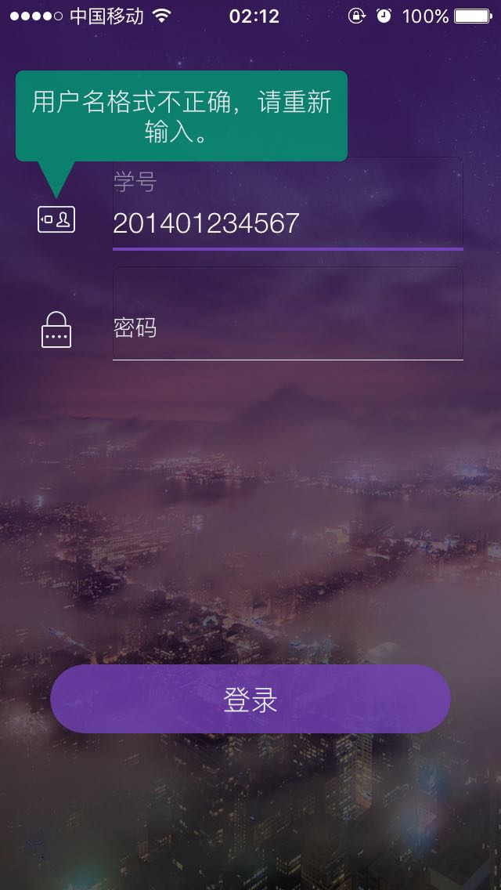
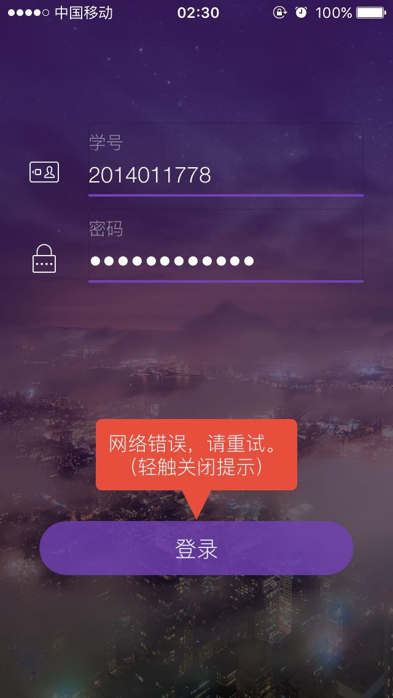
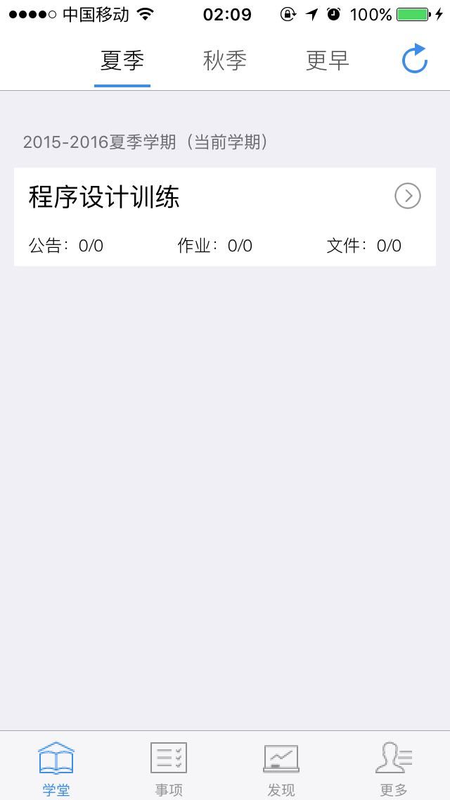
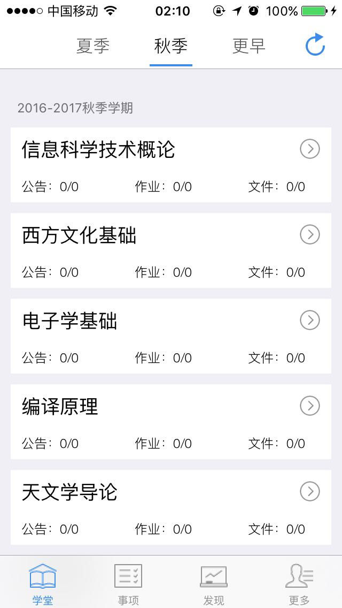
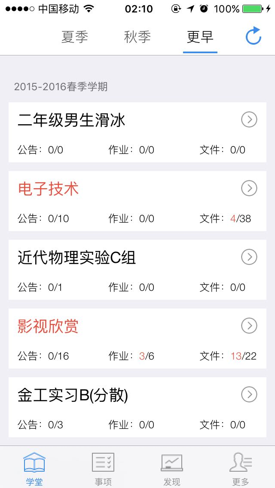
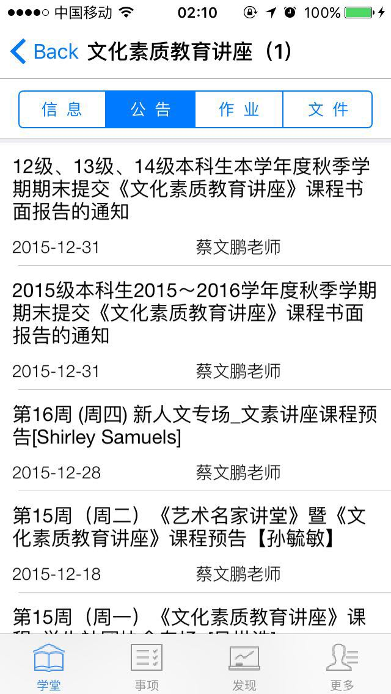
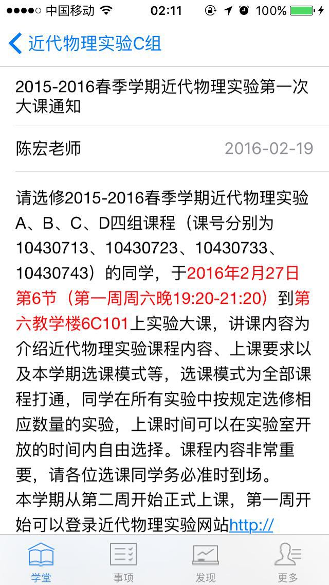
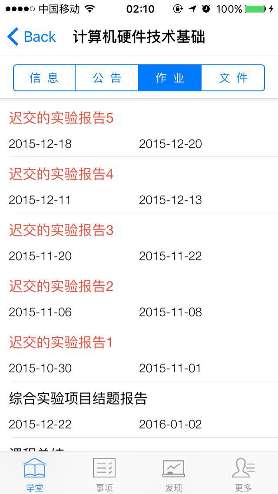
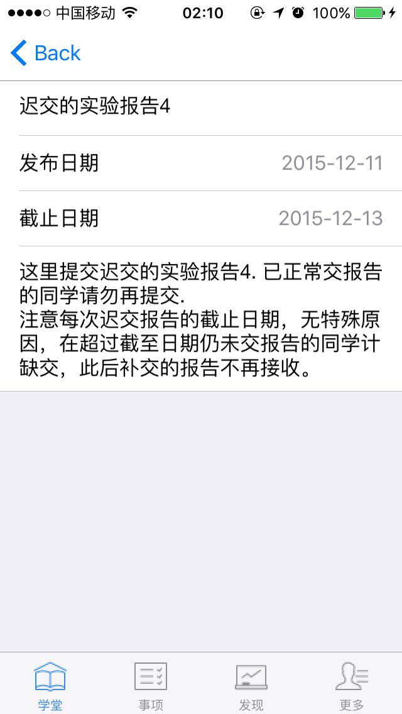

# iTsinghua

iTsinghua, an iOS cilent designed for undergraduates at Tsinghua University.

## Overview

* Launch View
* Login View
* Web Learning School
  + Announcement
  + Homework
  + <!--File-->
* <!--More-->

## Launch View

## Login View

#### Spell Check

#### Net Check

## Web Learning School

#### Course List

#### Announcement List

#### Announcement Detail

#### Homework List

#### Homework Detail

